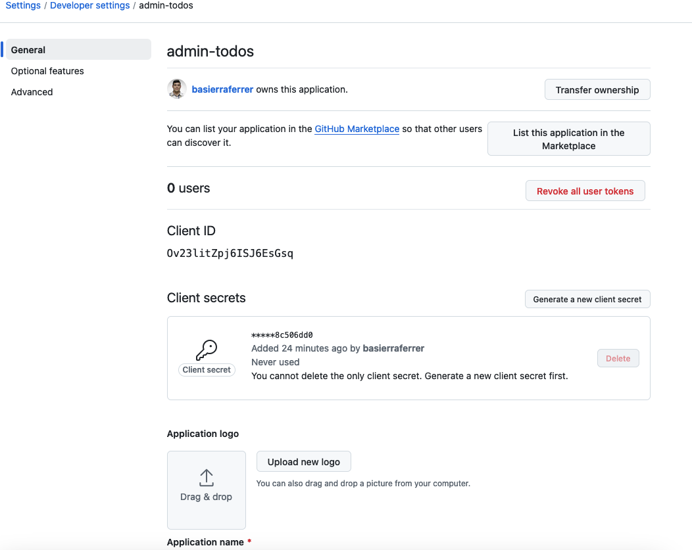
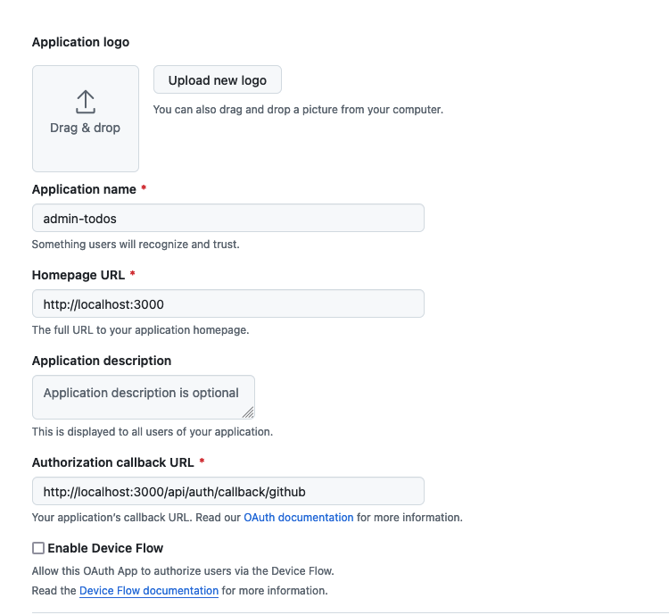
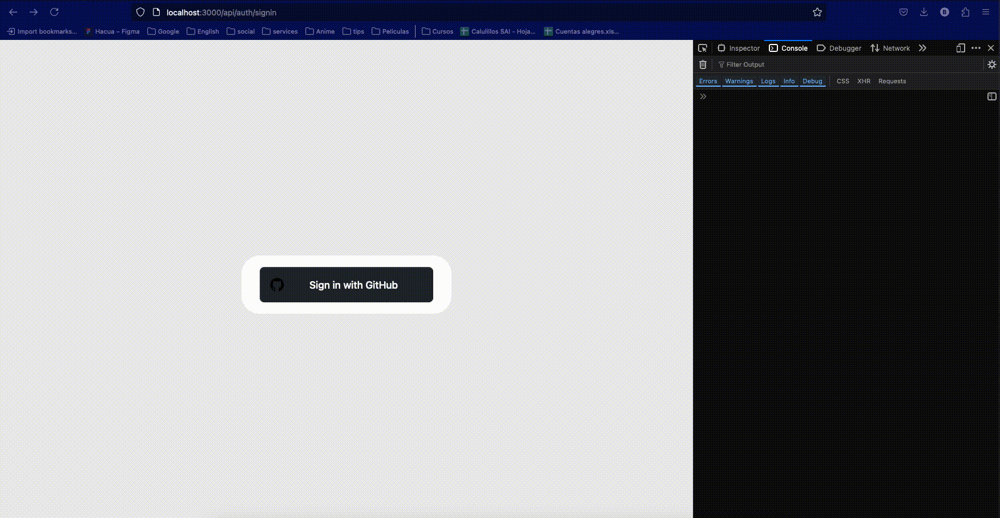

Estoy siguiendo los pasos del video de GithubProvider, cree todo tal como lo indico el profe en el video





Agregue las keys al .env

```
GITHUB_ID=Ov23litZpj6ISJ6EsGsq
GITHUB_SECRET=aaa5cbb19f3f876e9934ebc7fffefd268c506dd0
```

Pero cuando le doy al botón de sign in no me hace redirect correctamente


